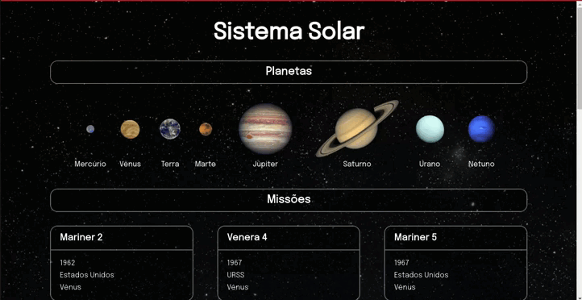

# Projeto 08 - Solar System

Oi. Este foi um dos projetos que eu fiz durante meu curso na Trybe. Confira os detalhes dele abaixo.

## Nome do Projeto
Solar System (Sistema Solar)

## Linguagens e Ferramentas Utilizadas
 - JavaScript
 - HTML
 - CSS
 - [React](https://pt-br.reactjs.org/)

## Objetivos do Projeto
O intuito deste projeto foi aplicar os conhecimentos adquiridos acerca da biblioteca React. O projeto teve como estrutura a montagem de uma página que representasse o sistema solar. Utilizando a aplicação, a pessoa usuária é capaz de visualizar todos os planetas do sistema solar renderizados na tela, e também poderia visualizar algumas cartas com informações a respeito de missões espaciais.

## Instruções para visualização
Comando para clonar o projeto:
 - `git clone git@github.com:BrunoSayago/projeto-08-SolarSystem.git`
 
Se necessário, instalar as dependências:
 - `npm install`
  
Esse projeto pode ser visualizado no navegador utilizando o comando:
- `npm start`
